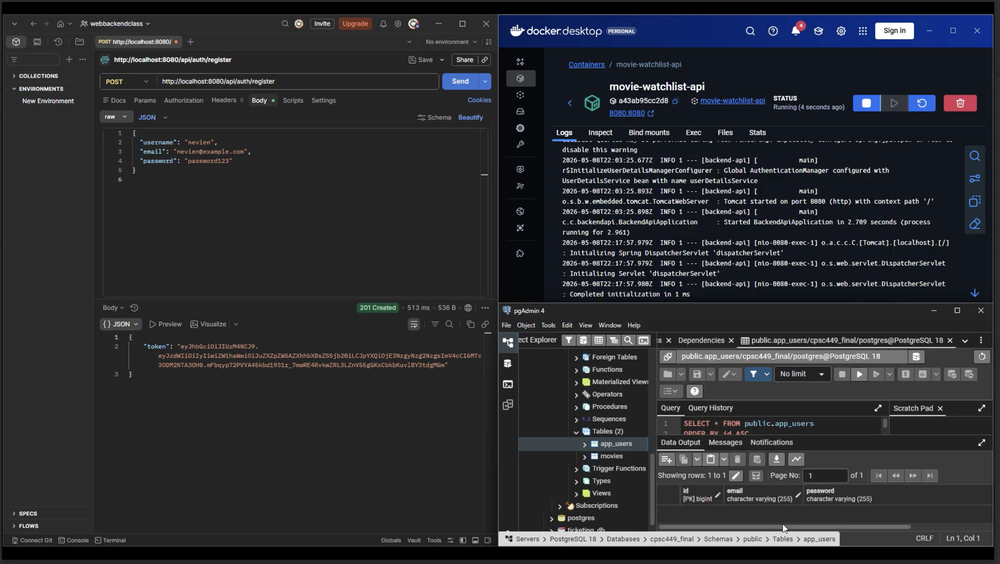
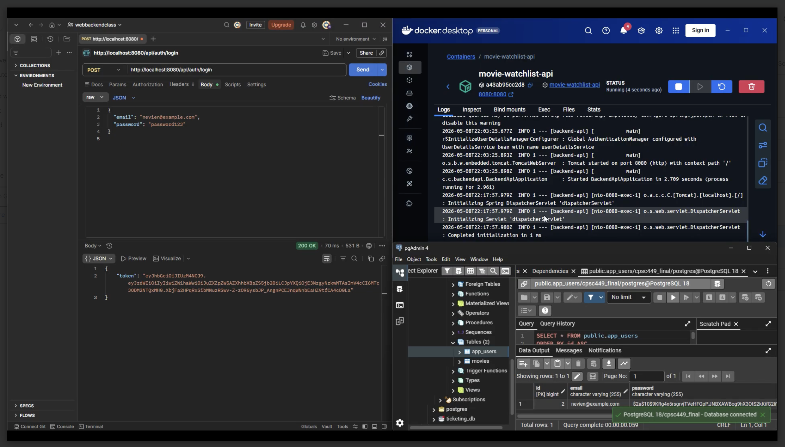
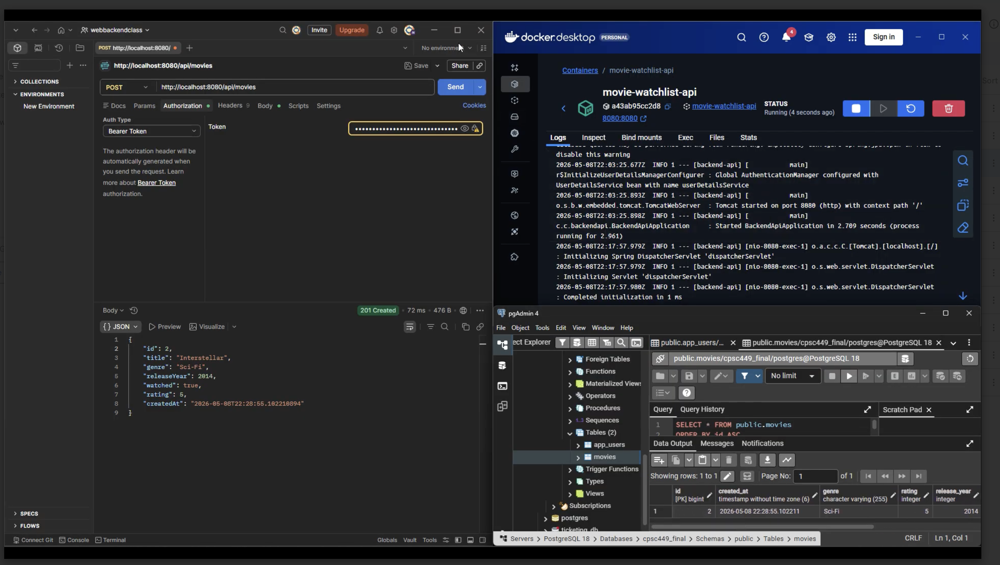
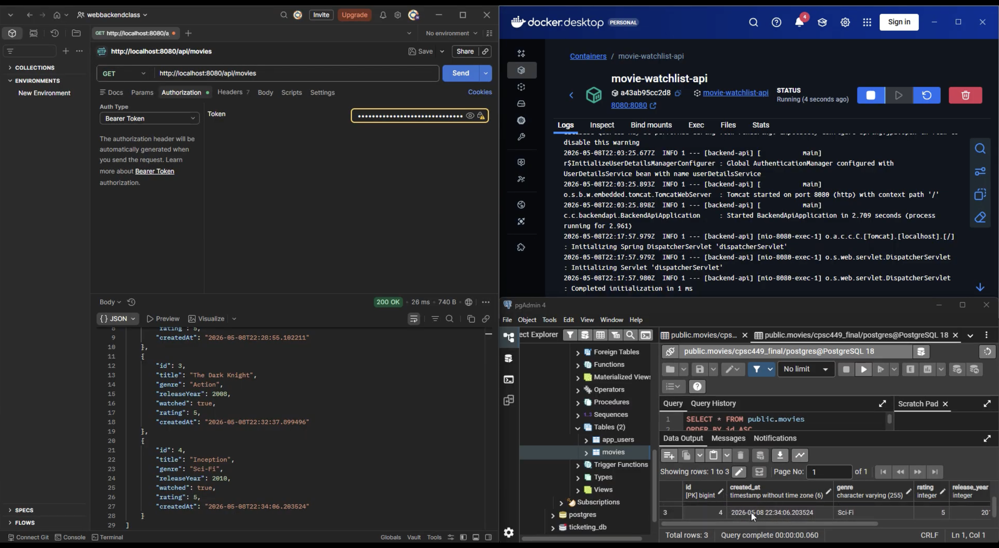
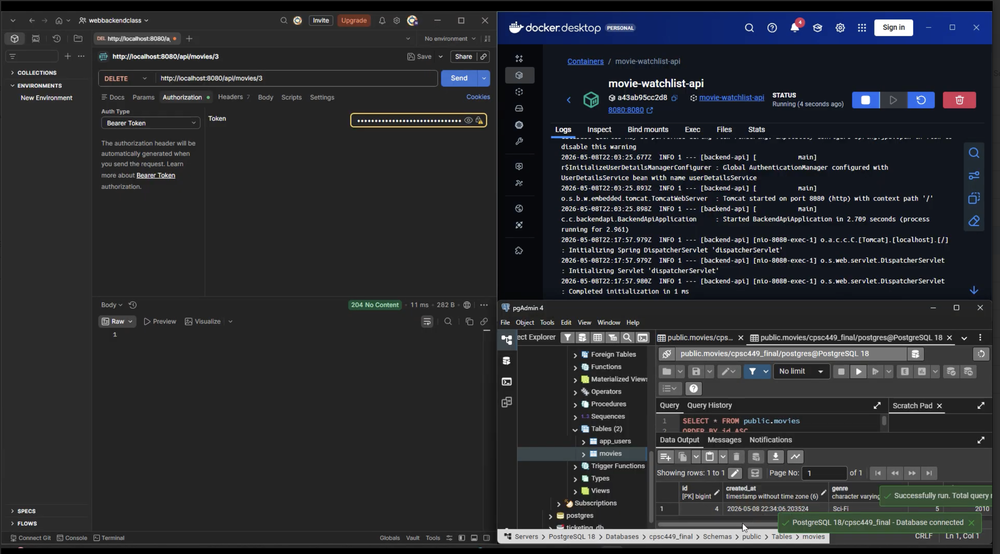

# CSPC 449 Section 02 Final Project 


This is our CPSC 449 final project.
It is a Spring Boot backend REST API for a movie watchlist. It uses PostgreSQL for the database, JWT authentication with Spring Security, and it runs from Docker.

- Youtube video link: https://youtu.be/lhnSFRuebg4

# Group Information


Moses Bui
* Email: mosesbui@csu.fullerton.edu
* CWID: 837586106

Ricardo H Pena
* Email: pena_ricky@csu.fullerton.edu
* CWID: 894117829

Steve Truong
* Email: paogat123@csu.fullerton.edu
* CWID: 891463275

Nevien Udugama
* Email: nevien246@csu.fullerton.edu
* CWID: 885830653


# Build Information

Run:

```powershell
docker build -t movie-watchlist-api:1.0 
```
```powershell
docker run -d --name movie-watchlist-api -p 8080:8080 -e SPRING_DATASOURCE_URL=jdbc:postgresql://host.docker.internal:5432/cpsc449_final -e SPRING_DATASOURCE_USERNAME=postgres -e SPRING_DATASOURCE_PASSWORD=YOUR_PASSWORD -e APP_JWT_SECRET=cpsc449-final-project-secret-key-32chars-minimum movie-watchlist-api:1.0
```

# Screenshots

### Register User

`POST /api/auth/register`



---

### Login User

`POST /api/auth/login`



---

### Create Movie Resource

`POST /api/movies`



---

### Read All Movie Resources

`GET /api/movies`



---

### Delete Movie Resource

`DELETE /api/movies/{id}`


